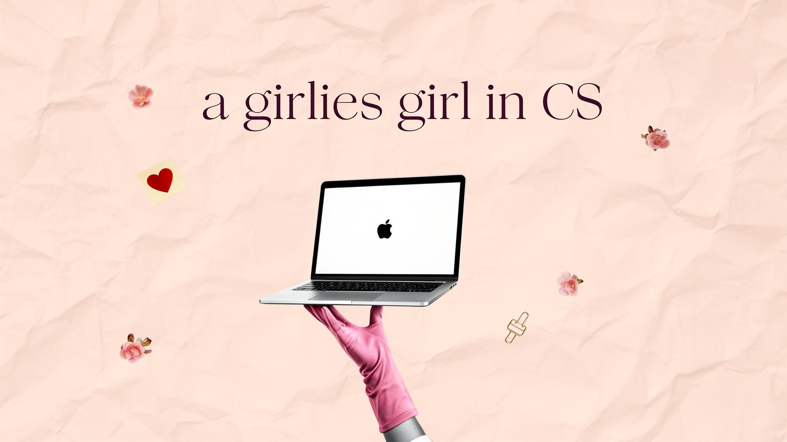

# Hola amigaaa, I'm Maria Angel 👩🏻‍💻✨  
### your go-to programmer bestie 💕🌷

  

Computer Science student passionate about building technology that feels useful, creative, and human.  
I love working with React, designing web experiences, and creating projects that mix innovation, beauty, and purpose.

## Websites 🌐
- 🌷 [bookifi.co](https://bookifi.co)
- 💼 [consulting.bookifi.co](https://consulting.bookifi.co/)
- ✨ [grupopalacios.co](https://grupopalacios.co)

## Badges 💌

## About me 💫
- 💻 CS student at NJIT
- ⚛️ I absolutely love building with React
- 🌷 Passionate about anything that blends girly creativity with tech
- 🎨 Interested in full-stack development, UX/UI, and digital design
- 📄 Built an ATS-style resume platform that connects with APIs and helps automate resume workflows
- 🗣️ I speak both Spanish and English
- ✨ Your go-to programmer bestie

## Tech I like working with 👩🏻‍💻
React • JavaScript • Python • SQL • HTML • CSS • Git • C++

## Projects I’m proud of 🚀
- 📄 **ATS Resume Platform** — a platform I built to support resume workflows using API integrations and connected services
- 💻 Web and software projects that combine functionality, design, and creativity
- 🌸 Digital experiences that make tech feel more personal, elegant, and expressive

## Currently 🌟
- 🤖 Doing research with AI and robots
- 💕 Building projects that combine creativity and technology
- 🚀 Exploring the intersection of software, design, and entrepreneurship
- 🌷 Learning, creating, and making tech feel more personal and expressive

## GitHub Stats 📈

---
*"Where girly creativity meets tech."* 💗
